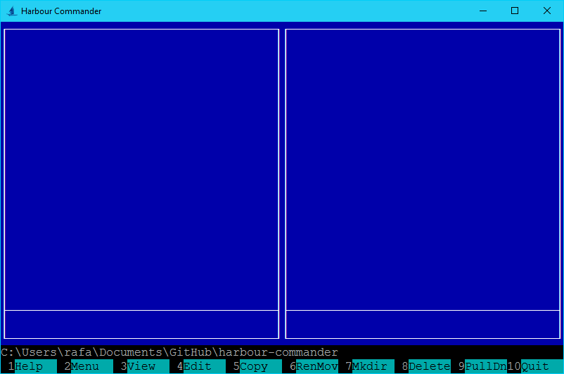
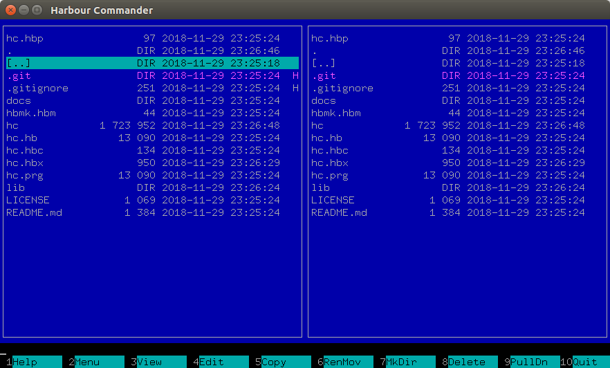

# Welcome to Harbour Commander

Harbour Commander is an file manager for cross-platform. The Harbour Commander was completely written in [Harbour 3.4](https://github.com/vszakats/harbour-core) language, and is thus very fast.

## Windows 10

## Linux

## Oracle Solaris

## macOS
