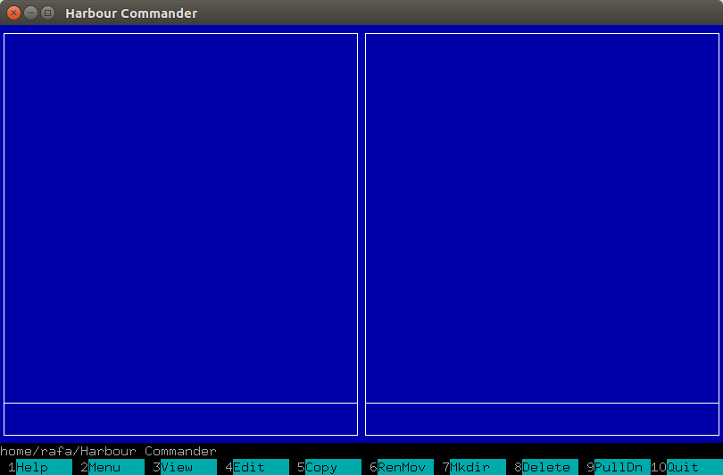

# harbour-commander
Harbour Commander is an file manager for cross-platform, in the close tradition of Norton Commander. The Harbour Commander was completely written in [Harbour](https://github.com/harbour/core) language, and is thus very fast.

